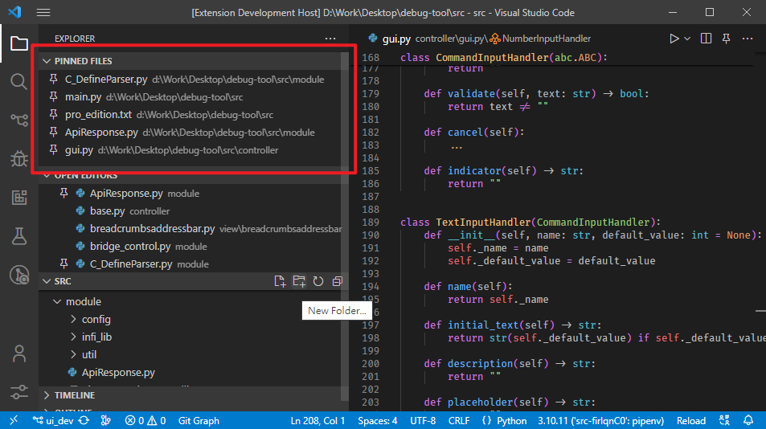

# VSCode - Pinned Panel

A simple extension that give those pinned files an individual view panel.

Just list all those builtin pinned tabs. As simple as that.

# Requirement

Make sure the setting  is set to `multiple` or `single`, or you may not able to pin any file to this Pinned Panel.
